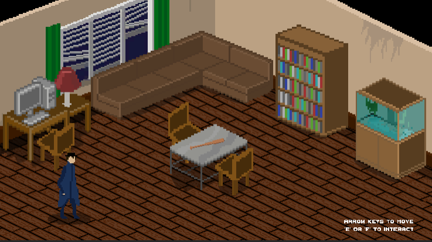
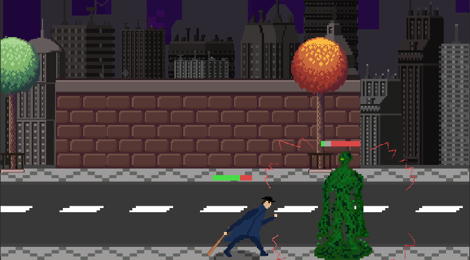

# Hi there 👋

- 🔧 Working on: A [Text Adventure video game](https://github.com/Silver-Sword/Text-Adventure) and a personal portfolio website
- 🌱 Learning: persistent segment trees and dynamic connectivity
- ❤️ Passionate about: competitive programming, backend development, game development, and global sustainability
- 

  
 📈 GitHub Statistics 

  

    <!-- I'm hoping that I will improve my github stats to warrant displaying this one as well -->
    <!--  --> 
     
    
  
  

## ⚡ My Skill Set
<table align="center">
  <tr>
    <td align="center"> <b>Programming Languages</b></td>
  </tr>
  <tr>
    <td align="center">
      
      
      
      
      
      
      
      
      
      
    </td>
  </tr>
  
  <tr>
    <td align="center">
      <b>IDEs</b>
    </td>
  </tr>
  <tr>
    <td align="center">
         
      
         
      
      
    </td>
  </tr>
</table>

<!-- 
## 📈 Github Stats

** Hopefully, I will improve these stats to the point where they should displayed in this readme
-->

## 🌟 Project Spotlight: Subliminal  

#### Overview
- a third person RPG in a top-down 2D, pixelated world with both puzzles and realtime combat
- the player controls a detective exploring the minds of 4 characters to solve a murder mystery

<!--    -->
  
  

#### Development Details
- Developed in collaboration with Kaeden Le, Jordan Hannon, and Josef Ortiz-Feder over the course of 3 months
- Technologies used: Unity, C#, Jira, Github, Visual Studio, Visual Studio Code, Discord

#### Interested?
*Want to see more?* Our game was played during a [recorded livestream](https://youtu.be/y8J5yYUdjnU?si=VhVZxYEI34tQrfp5&t=8484) between 2:21:30 and 3:42:00.

<!--
  References
  (example) https://github.com/colinbut/colinbut/blob/main/README.md?plain=1
  (logo images) https://github.com/marwin1991/profile-technology-icons/blob/main/README.md?plain=1#%EF%B8%8F-cc
-->
